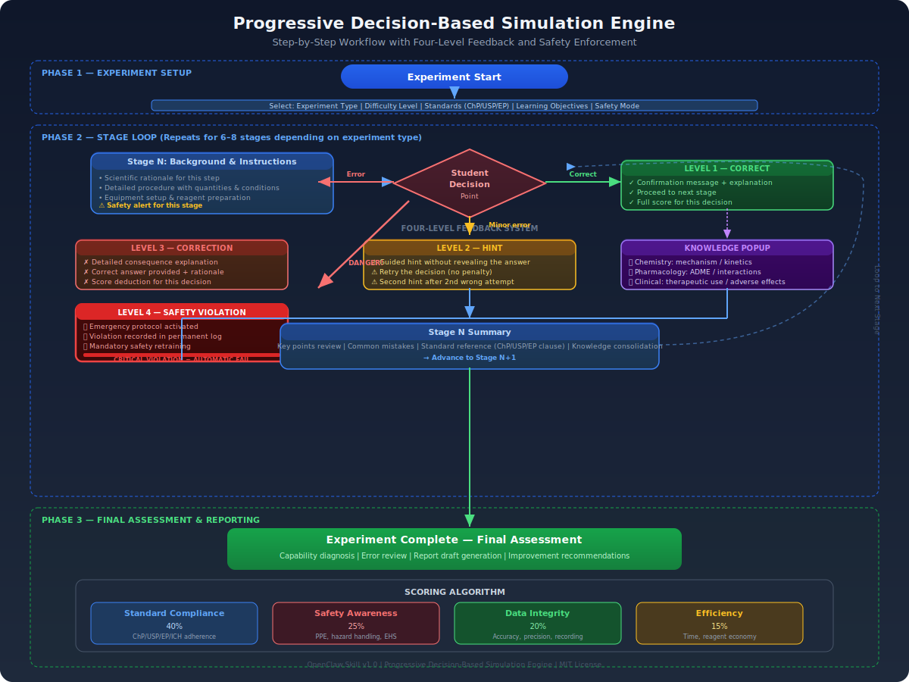

# Pharmaceutical Chemistry Lab Simulator | 医药化学实验模拟系统

[](https://opensource.org/licenses/MIT)
[](https://github.com/topics/openclaw-skill)
[](https://github.com/topics/pharmaceutical-chemistry)
[](https://github.com/topics/virtual-lab)
[](https://github.com/topics/gmp)
[](https://github.com/topics/pharmacopoeia)

> A comprehensive pharmaceutical chemistry experiment simulation system for medical school educators and students. Progressive decision-based simulation covering drug synthesis, drug analysis, pharmaceutics, and pharmacology/toxicology — with dual-standard compliance (domestic + international).

> 一套面向医学院教师和学生的医药化学实验模拟系统。采用渐进式决策模拟方法，覆盖药物合成、药物分析、药剂学、药理/毒理四大实验类型，遵循中国药典/GMP/GLP与USP/EP/ICH双重标准体系。

---

## 📋 目录 | Table of Contents

- [概述 | Overview](#概述--overview)
- [八大核心功能 | Eight Core Functions](#八大核心功能--eight-core-functions)
- [四维标准体系 | Four-Dimensional Standards](#四维标准体系--four-dimensional-standards)
- [渐进式决策模拟 | Progressive Decision Simulation](#渐进式决策模拟--progressive-decision-simulation)
- [文件结构 | File Structure](#文件结构--file-structure)
- [快速开始 | Quick Start](#快速开始--quick-start)
- [使用场景 | Use Cases](#使用场景--use-cases)
- [标准合规 | Standards Compliance](#标准合规--standards-compliance)
- [致谢 | Acknowledgments](#致谢--acknowledgments)
- [许可证 | License](#许可证--license)

---

## 概述 | Overview

Pharmaceutical chemistry education faces the "three highs and three difficulties" challenge (高投入、高难度、高风险；难实施、难观摩、难再现). This Skill addresses these challenges through **progressive decision-based simulation** — a methodology that breaks down experiments into stages with decision points, providing immediate feedback, safety prompts, and knowledge anchors.

医药化学教育面临"三高三难"挑战（高投入、高难度、高风险；难实施、难观摩、难再现）。本 Skill 通过**渐进式决策模拟**方法解决这些问题——将实验分解为带决策点的阶段，提供即时反馈、安全提示和知识锚点。

### 核心设计原则 | Core Design Principles

1. **安全优先 Safety First** — All simulations begin with safety assessment
2. **标准合规 Standards Compliance** — Every step references applicable standards
3. **渐进决策 Progressive Decision** — Branching paths with error feedback
4. **双角色适配 Dual-Role** — Teacher mode (lesson plans/SOPs/assessments) + Student mode (pre-lab/simulation/reports)
5. **试错学习 Trial-and-Error Learning** — Safe virtual environment for making mistakes
6. **知识锚点 Knowledge Anchors** — Each step links to chemistry, pharmacology, and clinical significance

---

## 八大核心功能 | Eight Core Functions

| # | 功能 | Function | 用户 | 产出 |
|---|------|----------|------|------|
| F1 | 药物合成实验模拟 | Drug Synthesis Simulation | Teacher/Student | Step-by-step simulation + reaction mechanism + safety |
| F2 | 药物分析实验模拟 | Drug Analysis Simulation | Teacher/Student | Instrument workflow + data processing + compliance |
| F3 | 药剂学实验模拟 | Pharmaceutics Simulation | Teacher/Student | Formulation process + GMP compliance + QC |
| F4 | 药理/毒理实验模拟 | Pharmacology/Toxicology Simulation | Teacher/Student | Study design + 3R principles + data analysis |
| F5 | 实验方案与SOP生成 | Protocol & SOP Generation | Teacher | Standardized SOP + reagent/equipment lists |
| F6 | 安全评估与应急预案 | Safety Assessment & Emergency Plans | Teacher/Student | Risk matrix + safety plans + MSDS links |
| F7 | 实验考核与评分 | Assessment & Scoring | Teacher | Question bank + rubrics + diagnostic reports |
| F8 | 实验报告撰写辅导 | Lab Report Writing Guidance | Student | Report template + data analysis guidance + self-check |


> **Figure 1**: System architecture overview — Eight core functions organized into four functional zones (Experiment Simulation, Instructor Toolkit, Safety & Assessment, Dual-Standards Engine) with dual-role interface (Instructor / Student).

---

## 四种实验类型流程 | Four Experiment Type Workflows


> **Figure 2**: Stage-by-stage workflow comparison for all four experiment types — Drug Synthesis (7 stages), Drug Analysis (6 stages), Pharmaceutics (8 stages), and Pharmacology/Toxicology (7 stages), each with standard references.

---

## 四维标准体系 | Four-Dimensional Standards

| Dimension | Domestic (国内) | International (国际) |
|-----------|----------------|---------------------|
| **Pharmacopoeia** | Chinese Pharmacopoeia (ChP 2020) | USP-NF, EP, JP, BP |
| **Manufacturing** | GMP (2010 Revision) | WHO-GMP, cGMP (FDA), EU-GMP |
| **Research** | GLP (2017 Revision) | OECD-GLP, FDA-GLP |
| **Guidelines** | NMPA Technical Guidelines | ICH (Q/S/E Series) |
| **Regulations** | Drug Administration Law | FDA 21 CFR, EMA EudraLex |
| **Safety & Ethics** | Lab Safety Standards, Hazardous Chemicals Regulations | EHS, OSHA, BSC, 3R Principles |

---

## 渐进式决策模拟 | Progressive Decision Simulation



> **Figure 3**: Progressive decision-based simulation engine — Three-phase workflow (Setup → Stage Loop → Final Assessment) with four-level feedback system (Correct → Hint → Correction → Safety Violation) and weighted scoring algorithm.

### 模拟流程结构 | Simulation Flow Structure

```
[实验概述 Experiment Overview]
    ↓
[阶段循环 Stage Loop] (6-8 stages)
    ├─ 背景说明 Background
    ├─ 操作指引 Instructions
    ├─ ⚠️ 安全提示 Safety Alert
    ├─ 决策点 Decision Point (choose/judge/input)
    │   ├─ Correct → next stage
    │   ├─ Minor error → hint + retry
    │   ├─ Serious error → consequence + explanation + retry
    │   └─ Dangerous → 🚨 safety warning + emergency + record
    ├─ 📖 知识弹窗 Knowledge Popup
    └─ 阶段小结 Stage Summary
    ↓
[实验总结 Experiment Summary]
    ├─ 评分 Scoring (4 dimensions)
    ├─ 能力诊断 Capability Diagnosis
    ├─ 错误回顾 Error Review
    └─ 报告草稿 Report Draft
```

### 评分算法 | Scoring Algorithm

```
Total Score = Standard Compliance (40%) + Safety Awareness (25%) 
            + Data Integrity (20%) + Efficiency (15%)
```

---

## 文件结构 | File Structure

```
pharmaceutical-chemistry-lab-simulator/
├── SKILL.md                          # Core instruction file
├── README.md                         # This file (bilingual)
├── LICENSE                           # MIT License
├── CITATION.cff                      # Academic citation
├── .gitignore
│
├── references/                       # 9 Professional reference documents
│   ├── experiment-standards-reference.md    # ChP/USP/EP/ICH/GMP/GLP complete reference
│   ├── drug-synthesis-guide.md              # Drug synthesis experiment guide
│   ├── drug-analysis-guide.md               # Drug analysis experiment guide
│   ├── pharmaceutics-guide.md               # Pharmaceutics experiment guide
│   ├── pharmacology-toxicology-guide.md     # Pharmacology/toxicology guide
│   ├── safety-ethics-guide.md               # Safety & ethics (EHS/3R/BSC)
│   ├── simulation-design-guide.md           # Simulation design methodology
│   ├── assessment-rubrics-reference.md      # Assessment rubrics reference
│   └── experiment-report-guide.md           # Lab report writing guide
│
├── assets/                           # 8 Template files
│   ├── experiment-simulation-template.md     # Progressive simulation template
│   ├── experiment-protocol-template.md       # SOP template
│   ├── teacher-lesson-plan-template.md       # Teacher lesson plan template
│   ├── student-pre-lab-template.md           # Student pre-lab template
│   ├── lab-report-template.md                # Lab report template
│   ├── safety-assessment-template.md         # Safety assessment template
│   ├── assessment-rubric-template.md         # Assessment rubric template
│   └── experiment-design-matrix-template.md  # Design matrix template
│
└── docs/
    └── images/                       # SVG flowcharts
        ├── eight-functions-architecture.svg
        ├── simulation-workflow.svg
        └── standards-comparison.svg
```

---

## 快速开始 | Quick Start

### For Teachers | 教师使用

1. **Prepare a lab session**: "I need to prepare an aspirin synthesis lab for 3rd-year pharmacy students, 2 class hours."
   - Skill generates: SOP + safety assessment + simulation flow + assessment rubric

2. **Design an assessment**: "Generate exam questions for HPLC analysis of paracetamol tablets."
   - Skill generates: 15 questions (pre-lab 5 + operation 5 + report 5) + scoring rubric

### For Students | 学生使用

1. **Pre-lab preparation**: "I need to prepare for the vitamin C injection assay (iodometry) experiment."
   - Skill generates: pre-lab materials + simulation + report template

2. **Simulate an experiment**: "Simulate the aspirin synthesis experiment."
   - Skill runs: 7-stage progressive simulation with 3+ decision points

### For Experts | 专家使用

1. **Standards comparison**: "Compare ChP and USP dissolution requirements for aspirin enteric-coated tablets."
   - Skill generates: comparison table + compliance strategy

---

## 使用场景 | Use Cases

| Scenario | User | Input | Output |
|----------|------|-------|--------|
| Lab preparation | Teacher | Topic + student level + hours | SOP + safety plan + simulation + assessment |
| Pre-lab study | Student | Experiment name | Pre-lab report + simulation + report template |
| Safety review | Teacher/Student | Reagent list | Risk matrix + PPE + emergency plan |
| Standards comparison | Expert | Standard items | Comparison table + compliance strategy |
| Report review | Teacher | Student report | Score + diagnostic report + improvement suggestions |

---

## 标准合规 | Standards Compliance

### Coverage | 覆盖范围

- **Chinese Pharmacopoeia (ChP 2020)**: General chapters 0400-1200 + monographs
- **USP-NF**: General chapters <621>, <711>, <71>, <85>, <905> + monographs
- **European Pharmacopoeia (EP 11.0)**: General chapters + monographs
- **ICH Guidelines**: Q1A-Q14 (quality), S1-S11 (safety), E2-E8 (efficacy)
- **GMP**: China GMP (2010) + EU-GMP Annex 1 + FDA cGMP (21 CFR 210/211)
- **GLP**: China GLP (2017) + OECD-GLP + FDA-GLP (21 CFR 58)
- **Safety**: GHS classification + GB/T 27476 + OSHA + BSL-1 to BSL-4
- **Ethics**: 3R principles + IACUC + AVMA euthanasia guidelines


> **Figure 4**: Dual-standard compliance matrix — Domestic (ChP/GMP/GLP/NMPA) and International (USP/EP/WHO-GMP/OECD-GLP/ICH) standards with ICH harmonization hub, safety & ethics framework, and cross-reference comparison table.

### Key Standards Comparison | 关键标准对比

| Topic | ChP | USP | EP | Key Difference |
|-------|-----|-----|-----|----------------|
| Dissolution | 0931 | <711> | 2.9.3 | Apparatus same; media/judgment may differ |
| Sterility | 1101 | <71> | 2.6.1 | Media/culture similar; suitability test differs |
| Impurities | Q3A/Q3B | <476> | 2.4.24 | Thresholds aligned; reporting format varies |
| Residual Solvents | 0861 | <467> | 2.4.24 | ICH Q3C limits; methods may differ |
| Content Uniformity | 0941 | <905> | 2.9.40 | Calculation formulas differ |

---

## 致谢 | Acknowledgments

This Skill was developed with reference to the following standards, guidelines, and educational resources:

- Chinese Pharmacopoeia Commission (国家药典委员会)
- ICH (International Council for Harmonisation)
- FDA, EMA, NMPA regulatory guidance
- OECD Principles of Good Laboratory Practice
- GHTF/IMDRF medical device guidelines
- Virtual simulation experiment platforms (ilab-x, etc.)

本 Skill 的开发参考了以下标准、指南和教育资源：中国药典委员会、ICH国际协调理事会、FDA/EMA/NMPA监管指南、OECD良好实验室规范原则、虚拟仿真实验平台等。

---

## 许可证 | License

This project is licensed under the MIT License - see the [LICENSE](LICENSE) file for details.

本项目采用 MIT 许可证。

## Citation | 引用

If you use this Skill in your work, please cite it as:

```bibtex
@software{pharmaceutical_chemistry_lab_simulator,
  title={Pharmaceutical Chemistry Lab Simulator},
  author={OpenClaw},
  year={2025},
  url={https://github.com/abmarkguo/pharmaceutical-chemistry-lab-simulator}
}
```

## Keywords | 关键词

`pharmaceutical chemistry` `virtual lab` `experiment simulation` `drug synthesis` `drug analysis` `pharmaceutics` `pharmacology` `toxicology` `GMP` `GLP` `pharmacopoeia` `ChP` `USP` `EP` `ICH` `medical education` `pharmacy education` `progressive simulation` `decision-based learning` `lab safety` `3R principles` `quality control` `analytical method validation` `stability testing` `sterile manufacturing` `openclaw skill`

`医药化学` `虚拟实验` `实验模拟` `药物合成` `药物分析` `药剂学` `药理学` `毒理学` `GMP` `GLP` `药典` `中国药典` `美国药典` `欧洲药典` `ICH指导原则` `医学教育` `药学教育` `渐进式模拟` `决策式学习` `实验室安全` `3R原则` `质量控制` `分析方法验证` `稳定性试验` `无菌制剂`
